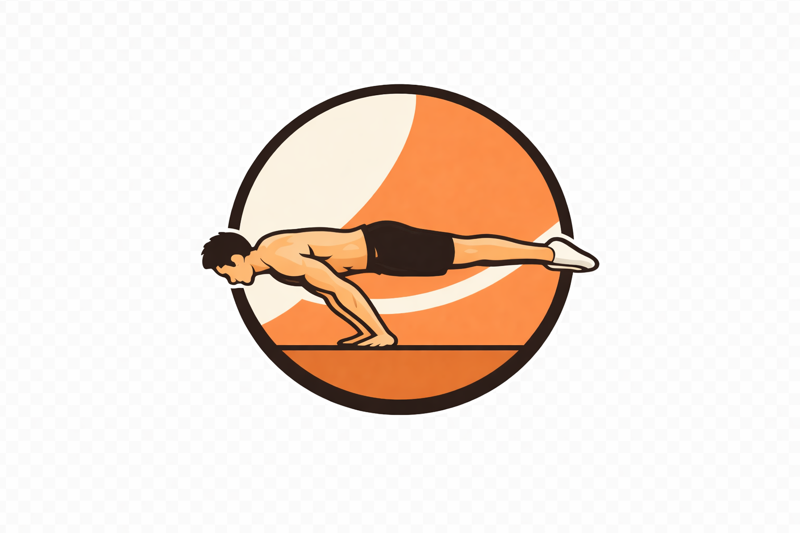

    

<h1 align="center">Caliroad</h1>

	The visual encyclopedia of Calisthenics exercises

    Caliroad is an encyclopedia of bodyweight exercises and skills partaining to Calisthenics. It features a graph view and a filtering system for viewing a map of exercises and the relations between them.

